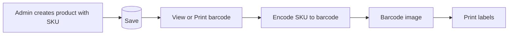
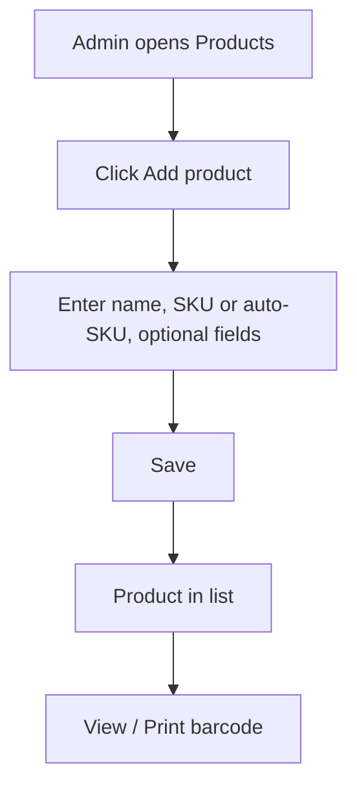
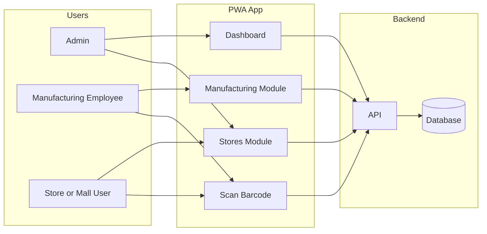
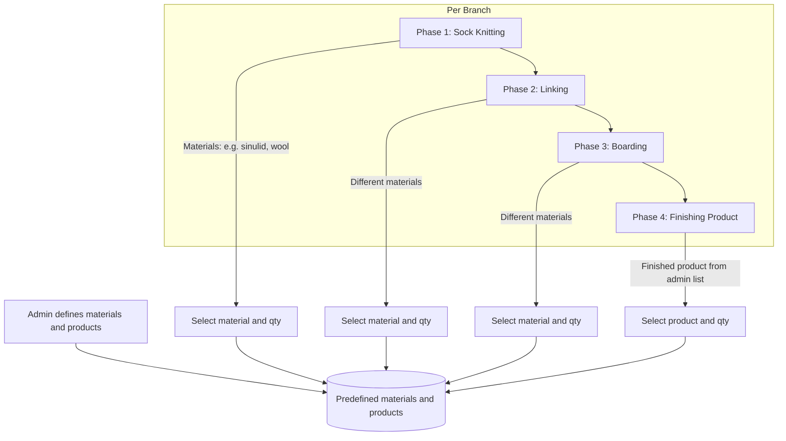

# Socks Manufacturing & Store Operations – Project Plan (Client Proposal)

**AKS Industries**

This plan is written so you can share it with your client as a workflow and scope document. It is human-readable and includes workflow illustrations.

---

## 1. Project goals (summary)

| Goal                   | Description                                                                                  |
| ---------------------- | -------------------------------------------------------------------------------------------- |
| Production and expense | Track daily output and material expense per manufacturing phase and per branch               |
| Store deliveries       | Record how many socks (by product) are sent to each partner mall (e.g. SM, Robinson) per day   |
| Store sales            | Record and view sales per mall per day                                                       |
| Product tracking       | Scan product barcode (per piece) for quick lookup and counts                                  |
| Access                 | PWA so employees and admins can install on phones/tablets and use in the field                |

---

## 2. Barcode – format and why

**Barcode (Code 128)** is used for per-piece scanning: one barcode per product SKU. It is fast for high volume (e.g. 1000 socks per day at delivery) and works with phone cameras and handheld scanners. Each product has a unique SKU; the barcode is that SKU in a form the scanner can read.

---

## 3. How we generate barcodes

**What the barcode is:** The barcode image is the product **SKU** (e.g. `SOC-001`) encoded in **Code 128** format. No separate "barcode number" is needed; the SKU is the barcode value.

**Where it is generated:** In the app, when the admin views or prints a product's barcode. The app draws the barcode from the product's SKU. Optionally, the server can generate barcode images for bulk export or PDF labels.

**Flow:**

1. Admin creates a product and sets (or the system assigns) a **SKU**.
2. Product is saved with that SKU.
3. On the product list or product detail screen, admin clicks **"View barcode"** or **"Print label"**.
4. The app generates the barcode from that product's SKU; the barcode image appears on screen.
5. Admin prints (browser Print, or print to PDF) and uses **label sheets** (e.g. A4 with multiple labels) or a **thermal label printer** to stick one label per piece for per-piece scanning.

No QR codes are used in this plan; scanning is barcode-only (per piece).

---

## 4. Admin: process of creating a product

Products are created in the admin side. Each product has a SKU; that SKU is used to generate the barcode and is what employees scan at manufacturing, delivery, and sales.

**Steps (human-readable):**

1. Admin logs in and opens **Products** (or **Inventory** > **Products**).
2. Clicks **"Add product"** or **"Create product"**.
3. Fills in:
   - **Product name** (e.g. "Ankle socks – Black").
   - **SKU** – either typed (e.g. `SOC-001`) or **auto-generated** by the system (e.g. next number or code). SKU must be unique. This value is what the barcode encodes.
   - Optionally: description, unit (e.g. "pair"), category.
4. Clicks **Save**. The product is stored and appears in the product list.
5. From the product list or product detail, admin can **view barcode** and **print labels** (see section 3). New products are then available in manufacturing (Phase 4 – Finishing product), delivery, and sales dropdowns and for barcode scan.

**Summary:** Create product (name + SKU) in admin → save → generate and print barcode from that SKU → use labels for per-piece scanning in the field.

---

## 5. High-level system overview

- **Admin:** Manages branches, materials, **products** (create product, view/print barcode), stores; views dashboard.
- **Manufacturing employee:** Logs materials per phase and final output per branch; can scan barcode.
- **Store/Mall user:** Logs deliveries and sales per store; can scan barcode (per piece).
- **PWA:** One installable app; works on phones/tablets. Scanning is barcode-only.

---

## 6. Manufacturing process – 4 phases (per branch)

Each **branch** has the same 4 phases. For each phase, the employee selects **predefined materials** (or in Phase 4, **predefined products**) and enters quantity. Materials and products are maintained by admin; products are created as in section 4.

**Workflow in the app:**

1. Employee opens app and selects **branch** and **date**.
2. **Phase 1 – Sock knitting:** Pick material(s) from list, enter quantity used. Submit.
3. **Phase 2 – Linking:** Same flow; different material list.
4. **Phase 3 – Boarding:** Same flow; different material list.
5. **Phase 4 – Finishing product:** Select **product** (from products created in admin), enter quantity produced. Can also scan barcode to select product. Submit.

Result: **daily material expense per phase per branch** and **daily finished output per branch** for the dashboard.

---

## 7. Stores – deliveries and sales

Stores (malls) are created in **admin**. For each store, the system tracks **deliveries** (units sent per product per day) and **sales** (units sold per product per day). Product selection can be by dropdown or by **scanning the product barcode** (per piece).

- **Admin:** Add store (name, code). Stores appear in delivery and sales screens.
- **Delivery:** Select store and date; select product (or scan barcode) and log quantity sent. For per-piece scanning, each scan adds one unit (or the UI adds one per scan and user can adjust).
- **Sales:** Select store and date; select product (or scan barcode) and log quantity sold. Same per-piece scan flow as needed.

Dashboard can show **per-store, per-day** delivery vs sales.

---

## 8. Product tracking – barcode scan only

Barcode on each piece = one product SKU. When the user scans in the app (manufacturing Phase 4, delivery, or sales), the app looks up the product by that SKU and lets the user log or confirm quantity in the current context (branch + phase, or store + date). No QR codes; scanning is barcode-only for speed when scanning many pieces per day.

---

## 9. Dashboard – what the admin sees

**Must-have:**

- **Sales:** Sales per day, per month; filters by date range, store, product.
- **Store comparison:** For each store: total delivered (per day/week/month) vs total sold. Highlights overstock or understock.
- **Manufacturing:** Per branch: output (e.g. Phase 4 output) vs material expense (Phases 1–3). Optional: cost per unit if you add material costs later.

**Additional ideas for the client:**

- **Branch comparison:** Output (units) per branch per day/week; which branch is most productive.
- **Material usage trends:** Which materials are used most; simple trend over time (helps procurement).
- **Store performance:** Rank stores by sales volume; which mall sells most.
- **Product performance:** Which SKUs sell best per store or overall.
- **Simple alerts (future):** e.g. "Store X has received 2x last week's sales and sold only 50%" to prompt restock or promotion.

All of this can be shown with filters (date range, branch, store, product) and simple charts (tables, bar charts, line charts).

---

## 10. Data model (conceptual, for the proposal)

So the client sees what "we track" without technical detail:

- **Branches** – name, code.
- **Materials** – name, unit, phase (1/2/3).
- **Products** – SKU, name, barcode.
- **Stores** – name, code (e.g. SM Megamall).
- **Manufacturing records** – branch, date, phase, material or product, quantity.
- **Delivery records** – store, date, product, quantity sent.
- **Sales records** – store, date, product, quantity sold.
- **Users** – role (admin, manufacturing, store), assigned branch/store if needed.

Relationships: manufacturing ties to branch + phase; deliveries and sales tie to store; all use the same product list. Dashboard reads from these records and aggregates by date, branch, store, product.

---

## 11. PWA – install and use

- One web app; employees and store users open it in the browser and **install** (Add to Home Screen / Install app).
- Works on phones and tablets; responsive layout.
- Online-first; offline sync optional later.
- Roles: login by role (admin vs manufacturing vs store) so each user only sees Manufacturing, Stores, or Dashboard as needed.

---

## 12. Implementation phases (for timeline and proposal)

| Phase                | Scope                                                                                    | Outcome                                                   |
| -------------------- | ---------------------------------------------------------------------------------------- | --------------------------------------------------------- |
| **1. Setup and auth**  | App setup, auth, roles. Admin: branches, stores, **products** (create with name + SKU), materials. | Admin can define branches, stores, materials, products    |
| **2. Barcode generation** | In the app: "View barcode" / "Print label" per product using SKU. Optional: server-side for bulk/PDF. | Admin can generate and print barcodes for each product.  |
| **3. Manufacturing**  | 4-phase flow per branch; material/product selection; quantity entry; optional barcode scan in Phase 4. | Daily production and material expense per branch recorded |
| **4. Stores**         | Delivery and sales entry per store per day; product selection and barcode scan (per piece). | Delivery and sales per store per day recorded            |
| **5. Dashboard**      | Reports and filters: sales, delivery vs sales per store, output vs expense per branch; basic charts. | Client sees agreed metrics and comparisons                |
| **6. Polish**         | PWA installability, validation, UX.                                                     | Ready for rollout to employees and malls                 |

---

## 13. What to give the client

- **This document** – as the main workflow and scope.
- **Sections 3 and 4** – how barcodes are generated and how products are created in admin.
- **Sections 5, 6, 7** – system overview, manufacturing phases, stores flow.
- **Section 9** – dashboard and extra ideas to agree on.
- **Section 12** – implementation phases and timeline.

You can export this plan to PDF and use it as the formal proposal.

---

## Project timeline

**Total duration: 3 months** from project kickoff to rollout.

This covers all six implementation phases above, plus time for client feedback, review, and deployment. The 3‑month timeline is the agreed target for delivering the full system ready for daily use by staff.
